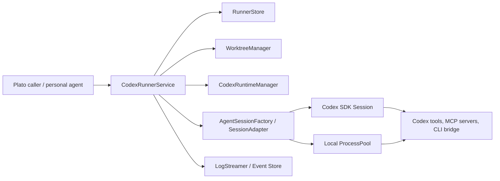
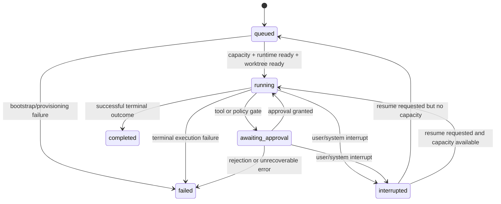

# Codex Runner Architecture Spec

## Status

- Owner: `services/codex-runner`
- Scope: local orchestration service for Codex-SDK-first personal agents such as Hermes and OpenClaw
- Audience: service implementers, agent authors, adjacent Plato services integrating with task execution
- Intent: define the target architecture while staying grounded in the current runner contracts and implementation

## 1. Product Definition

`codex-runner` is the local execution control-plane for personal software agents. It accepts agent tasks, allocates isolated git worktrees, ensures the Codex runtime is available, starts and supervises Codex-backed sessions, records structured events, and preserves enough state for interruption, resume, inspection, and recovery.

The service is intentionally local-first:

- It runs close to the developer workstation or trusted host.
- It treats the Codex SDK and local Codex CLI runtime as the primary execution substrate.
- It optimizes for a single user operating multiple named agents rather than multi-tenant anonymous workloads.
- It preserves execution state and filesystem location so an interrupted task can be understood and resumed instead of restarted from scratch.

### Product Goals

- Provide one explicit orchestration boundary for Codex task execution inside Plato.
- Make agent runs reproducible through stable task, session, and worktree identities.
- Support personal-agent workflows where the user may inspect, interrupt, approve, resume, or hand off tasks.
- Expose structured machine-readable events before adding richer UI or distributed coordination.

### Non-Goals

- General-purpose distributed scheduling across many hosts.
- Hidden autonomous retries that mutate repository state without preserving operator visibility.
- A framework for arbitrary sandbox providers beyond the interfaces needed to run Codex locally.

## 2. Design Principles

- Codex-SDK-first: model the runner around Codex sessions, tool calls, approvals, and streamed events. The CLI remains a compatible transport and bootstrap layer, not the product boundary.
- Explicit state over implicit behavior: task, session, and runtime lifecycle must be represented with named states and typed events.
- Local durability: preserve task metadata, session identity, logs, and worktree paths needed for debugging and recovery.
- Isolation by default: every runnable task gets its own git worktree and branch namespace.
- Small orchestration core: scheduling and state transitions stay in `CodexRunnerService`; side effects sit behind interfaces.
- Structured events first: text logs are derived views of typed execution events.
- Recovery over restart: interruption should preserve enough information to resume work intentionally.
- Narrow contracts: each collaborator should expose a small interface with visible failure modes.

## 3. System Context

The service sits between upstream Plato callers and the local Codex execution environment.

## 4. Core Components

### 4.1 CodexRunnerService

This is the orchestration core. It owns:

- task admission via `startTask`
- queue selection and capacity-aware scheduling
- runtime readiness checks
- worktree allocation and reuse
- transition into `running`, `interrupted`, `completed`, or `failed`
- resume and interrupt entrypoints
- task/event read APIs

It should remain the single place where lifecycle rules are validated.

### 4.2 RunnerStore

This persists durable task state. The current implementation is `FileRunnerStore`, but the contract is intentionally narrow so the storage backend can later move to SQLite or another embedded store without changing service behavior.

The store is the source of truth for:

- task identity and prompt
- task state
- priority
- preserved worktree path
- active session identity when attached

### 4.3 LogStreamer

This persists ordered `SessionEvent` records. The current file-backed implementation is acceptable for local-first operation because it preserves a complete event history and keeps the public abstraction centered on append/list semantics.

In the target design, the event stream becomes the primary audit surface for:

- operator UI
- task inspection
- approval checkpoints
- recovery diagnosis
- lightweight projections such as live status views

### 4.4 WorktreeManager

This owns repository isolation. `GitWorktreeManager` currently provisions a branch and worktree under `.plato/worktrees/<taskId>`. Future implementations may add cleanup, validation, and stale-worktree recovery, but the orchestration contract should stay focused on deterministic allocation.

### 4.5 CodexRuntimeManager

This ensures the local Codex runtime is present and healthy before execution begins. The current implementation performs:

- binary detection
- install when missing
- post-install verification

This manager is also the right boundary for future SDK/bootstrap concerns such as:

- version pinning
- capability negotiation
- model/provider configuration validation
- MCP dependency checks

### 4.6 Session Adapter

The service should converge on a Codex-SDK-backed session adapter behind `AgentSession` / `AgentSessionFactory`.

Current state:

- `ProcessBackedAgentSession` wraps a `ProcessPool`
- `createCodexAppServerCommand` launches `codex app-server --listen stdio://`
- stdout, stderr, and exit are converted into structured session events

Target state:

- the adapter should bind to Codex SDK session primitives directly where available
- the CLI/app-server path remains a compatibility transport for environments where the SDK still delegates to the local runtime

### 4.7 ProcessPool

The current `LocalProcessPool` is a local capacity gate and process supervisor. Even in an SDK-first architecture, a process layer remains useful for:

- hosting Codex app-server or bridge processes
- enforcing local concurrency
- sending interruption signals
- capturing process-level exit semantics separate from task-level success

## 5. Task Graph

The runner manages a small but explicit task graph. The current state union is:

- `queued`
- `running`
- `awaiting_approval`
- `interrupted`
- `completed`
- `failed`

`awaiting_approval` is already part of the public contract even though current scheduling does not yet drive it. That is a useful signal: approval is a first-class task state, not an afterthought in session logs.

### 5.1 Task Lifecycle

### 5.2 Scheduling Rules

- Admission is append-only: a new task is persisted before scheduling starts.
- Scheduling is capacity-aware and priority-ordered.
- Runtime readiness must happen before worktree allocation and session start.
- Worktree reuse is preferred on resume.
- Only one orchestration layer should choose the next runnable task.
- Terminal transitions must be visible in both task state and event stream.

### 5.3 Approval as a Graph Node

For personal agents, approval is not just a UI event; it is a control-plane checkpoint. The runner should treat approval waits as a persisted task/session condition with:

- the pending action or tool call
- the reason approval is required
- any expiry or cancellation policy
- the identity of the session waiting for approval

That allows the runner to survive restarts without losing the operator handoff point.

## 6. Session Model

The session model separates task identity from execution attempts.

### 6.1 Concepts

- Task: durable user intent and orchestration record
- Session: one live or historical execution attachment for a task
- Worktree: filesystem isolation boundary used by a task/session
- Event stream: ordered history that explains what happened during the session

### 6.2 Current Session Contract

`ManagedSession` currently contains:

- `sessionId`
- `taskId`
- `worktreePath`
- optional `pid`

This is enough for the present implementation, but the target model should extend session durability to include:

- session status: `starting`, `running`, `awaiting_approval`, `interrupted`, `exited`
- transport kind: `sdk`, `app-server`, `cli`
- started and ended timestamps
- last heartbeat timestamp
- exit classification: success, failure, interrupted, lost
- optional Codex conversation/run identifier when exposed by the SDK

### 6.3 Session Ownership

- A task can have many historical sessions over time.
- A task can have at most one active session.
- Resume should usually create a new session record linked to the same task and worktree, even if the underlying Codex runtime supports conversational continuation.
- The store should preserve the last active session id and enough metadata to inspect prior attempts.

## 7. Verification Model

Verification has two layers: runner verification and task-result verification.

### 7.1 Runner Verification

This answers "can we safely start Codex at all?"

- detect Codex runtime presence
- install if policy permits
- verify the installed runtime is callable
- emit runtime events for operator visibility
- fail the task explicitly when bootstrap cannot succeed

This is already present in `DefaultCodexRuntimeManager`.

### 7.2 Session Verification

This answers "is the session alive and coherent?"

- process or SDK session started successfully
- event stream attachment is active
- heartbeats or output continue within expected windows
- termination is captured with a typed exit event

The current implementation handles start, output, and exit events. A fuller session verification layer should add heartbeat and stale-session detection.

### 7.3 Task-Result Verification

This answers "did the agent produce an acceptable result?"

The runner should support post-run verification hooks without coupling them to the orchestration core. Likely verifiers include:

- repository cleanliness or expected diff checks
- command/test execution in the worktree
- policy checks for approval-required changes
- contract-specific assertions supplied by the caller

Result verification should produce typed events and a terminal classification, not silently rewrite `completed` into `failed` without explanation.

## 8. Data Model

The data model should stay compact and durable.

### 8.1 Task Record

Current durable fields:

- `taskId`
- `repoPath`
- `prompt`
- `priority`
- `state`
- optional `worktreePath`
- optional `activeSessionId`

Recommended near-term additions:

- `createdAt`
- `updatedAt`
- `requestedByAgent`
- `approvalState`
- `lastErrorCode`
- `lastErrorMessage`
- `verificationStatus`

### 8.2 Session Record

Not yet persisted separately in the current implementation, but the architecture should introduce a durable session table/collection with:

- `sessionId`
- `taskId`
- `transport`
- `worktreePath`
- `pid` or external runtime handle
- `state`
- `startedAt`
- `endedAt`
- `exitCode`
- `exitReason`
- optional `codexRunId`

### 8.3 Event Record

The current `SessionEvent` type is already a strong foundation. It includes runtime, session, and task events with optional metadata such as:

- `sessionId`
- `worktreePath`
- `errorCode`
- `message`
- `stream`
- `pid`
- `exitCode`

Recommended additions:

- `timestamp`
- `sequence`
- `approvalRequestId`
- `verificationId`
- `details` object for typed payloads that should not be overloaded into `message`

### 8.4 Persistence Strategy

Current persistence is file-backed JSON for both tasks and logs. That is acceptable for milestone development because it is:

- easy to inspect
- easy to fake in tests
- durable enough for single-user local flows

The next durable step should be a single embedded database with append-friendly event storage and explicit task/session tables, not a larger service dependency.

## 9. MCP / CLI Surface

The product surface should be defined around orchestration intent rather than implementation detail.

### 9.1 Core Control API

Whether exposed over TypeScript APIs, MCP tools, or a local CLI, the service should offer stable operations for:

- `startTask`
- `interruptTask`
- `resumeTask`
- `getTask`
- `listEvents`
- `listTasks`
- `approveTaskAction`
- `rejectTaskAction`

### 9.2 MCP Surface

An MCP façade is appropriate for upstream agents or operator tools that want to treat the runner as a local orchestration server. The MCP surface should expose tools such as:

- `runner.start_task`
- `runner.get_task`
- `runner.list_tasks`
- `runner.interrupt_task`
- `runner.resume_task`
- `runner.list_task_events`
- `runner.approve`
- `runner.reject`

It should expose resources or subscriptions for:

- task status snapshots
- per-task event streams
- approval queues

### 9.3 CLI Surface

A thin local CLI is useful for operators and shell-driven flows. Example command families:

- `codex-runner start`
- `codex-runner status`
- `codex-runner events`
- `codex-runner interrupt`
- `codex-runner resume`
- `codex-runner approve`

The CLI should be a client of the orchestration service contract, not a second orchestration path.

### 9.4 Codex Runtime Integration

The runner should integrate with Codex in this preference order:

1. Codex SDK session API
2. Codex app-server bridge for stdio/local RPC transport
3. Codex CLI bootstrap/install commands for environment readiness

This ordering preserves the architecture goal: Codex itself is the execution engine, while the runner owns orchestration, durability, and recovery.

## 10. Worktree Strategy

Worktrees are the isolation boundary for all repo-mutating work.

### 10.1 Allocation Rules

- One task maps to one branch namespace and one durable worktree path.
- Default branch pattern: `plato/task-<taskId>`
- Default worktree path: `<repoPath>/.plato/worktrees/<taskId>`
- The worktree path is persisted on the task record and reused across interruptions/resume.

### 10.2 Why Worktrees Matter

- concurrent tasks avoid stomping on the same checkout
- inspection is straightforward because the path is stable
- recovery is possible because intermediate filesystem state is preserved
- agent outputs remain attributable to a specific task

### 10.3 Operational Rules

- worktree creation must fail loudly with a typed provisioning error
- the runner should never silently redirect a task into a different worktree
- cleanup should be explicit and policy-driven, not automatic on every terminal state
- stale worktrees should be discoverable and repairable

## 11. Failure and Recovery

Failure handling must preserve operator understanding.

### 11.1 Failure Classes

- runtime bootstrap failure
- worktree provisioning failure
- session spawn failure
- session transport loss
- explicit operator interruption
- verification failure
- persistence failure

### 11.2 Recovery Rules

- preserve `worktreePath` on interruption and most failures
- preserve `activeSessionId` history through durable session records even if the active pointer is cleared
- record a typed event for every failure transition
- prefer resume over restart when repository state is still useful
- do not auto-delete worktrees, logs, or task records needed for diagnosis

### 11.3 Resume Semantics

Resume should mean:

- reusing the task record
- reusing the same worktree when valid
- creating a fresh session attachment
- appending a `task.resumed` event and subsequent session events

Resume should not mean:

- erasing prior failure/interruption evidence
- reallocating a new worktree unless the existing one is proven unusable and the operator accepts that change

### 11.4 Crash Recovery

On service restart, the runner should eventually reconcile:

- tasks marked `running` with no live session
- sessions whose backing process disappeared
- tasks waiting for approval with expired or missing session context

Recommended reconciliation outcomes:

- transition orphaned `running` tasks to `interrupted` or `failed` with a clear error code
- keep the worktree intact
- emit recovery events so operators know the state changed during reconciliation

## 12. Milestone-Oriented Evolution

This service should evolve in reviewable milestones.

### Milestone A: Current Foundation

- explicit task contracts
- local file-backed state
- git worktree allocation
- process-backed Codex app-server session
- runtime bootstrap and verification
- structured event logging

### Milestone B: Session Durability

- separate persistent session records
- timestamps and event sequencing
- reconciliation of orphaned running tasks

### Milestone C: Approval and Verification

- approval checkpoints as durable state
- pluggable result verification
- terminal outcome classification based on verifier output

### Milestone D: MCP/CLI Product Surface

- local MCP server façade
- thin operator CLI
- streaming status/resources for agent coordination

### Milestone E: SDK-First Runtime

- direct Codex SDK session adapter
- richer session metadata
- reduced dependence on process stdout/stderr parsing

## 13. Summary

`codex-runner` should stay a small, explicit local orchestration service that wraps Codex execution with durable task state, isolated worktrees, structured events, and recoverable session control. The current implementation already establishes the right boundaries. The main architectural direction is to deepen session durability, approval/verification semantics, and the public MCP/CLI surface while keeping Codex itself as the execution engine and the runner as the orchestration layer around it.
